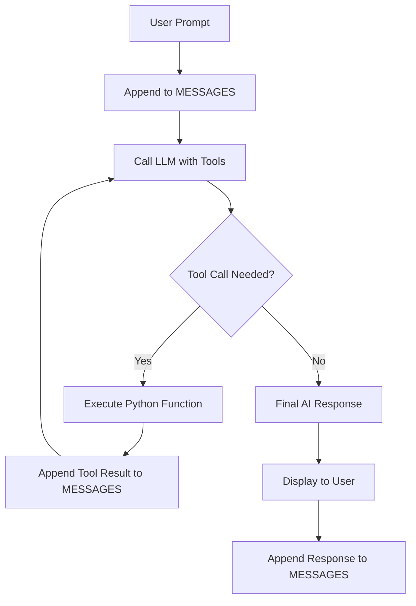

# 🧠 Technical Explainer: How the Movie Agent Works

This document provides a detailed breakdown of the implementation logic found in `main.ipynb`. The bot follows the **ReAct (Reasoning and Acting)** pattern to combine LLM intelligence with real-time data from the Nomad Movies API.

## 1. Initialization & Memory System

The bot's "intelligence" depends on its context window. We manage this through a global `MESSAGES` list.

- **Persistent Context**: Unlike simple stateless requests, every interaction (User, Assistant, and Tool Output) is appended to `MESSAGES`.
- **System Prompt**: We prime the model with a system message that establishes its **Persona** and **Behavioral Guidelines**.
  - **Persona**: The bot is instructed to act as a **friendly, passionate movie-buff friend** rather than a formal assistant. This ensures an engaging, conversational tone.
  - **Memory & Preferences**: The prompt also instructs the model to track user preferences (genres, watched movies) from the chat history to avoid redundant suggestions.

## 2. API Tooling

The bot doesn't "know" movie data from its training; it fetches it live.

- **Python Wrappers**: Functions like `get_movie_details(movie_id)` perform standard HTTP GET requests to the movie API.
- **JSON Schemas (`TOOLS`)**: We describe these functions to OpenAI using a specific schema. This tells the LLM the function name, what it does, and what parameters it accepts.

## 3. The Conversation Loop (`run_conversation`)

The core logic uses a multi-step "thinking" process:

1.  **User Input**: Your question is added to the `MESSAGES` list.
2.  **Detection (Step 1)**: The model is called with the full history and the list of available `TOOLS`. The model analyzes the input and decides which tool(s) to call.
    - _Example_: You ask "Who stars in Fight Club?". The model detects it needs movie ID 550 and decides to call `get_movie_credits`.
3.  **Execution (Step 2)**: Python executes the requested function and gathers the raw JSON data from the API.
4.  **Feedback (Step 3)**: The tool results are appended to the `MESSAGES` list with a `role: "tool"` attribute.
5.  **Final Synthesis (Step 4)**: The updated history is sent back to the model. Now that it "knows" the facts from the tool result, it writes a natural language response for you.

## 4. Enhanced Behavioral Logic

The bot implements specific logic to ensure efficiency and a premium user experience:

### A. Two-Stage Recommendation

To prevent "wall-of-text" fatigue, the bot follows a staged approach:

1.  **Stage 1 (Concise Lists)**: When first suggesting movies, the bot only shows `Title (Year) - ⭐️ VoteAverage`. Posters and summaries are withheld.
2.  **Stage 2 (Detail on Demand)**: Only when the user expresses interest in a specific title does the bot fetch and display rich details.

### B. Conversational Synthesis

Unlike a typical database query, the bot is instructed to **weave information into natural conversation**. Instead of using rigid bullet points for movie details, it uses sentences to discuss the runtime, plot, and production trivia, maintaining its "movie-buff friend" persona.

## 5. Design Pattern: ReAct

## 5. Visual Workflow

